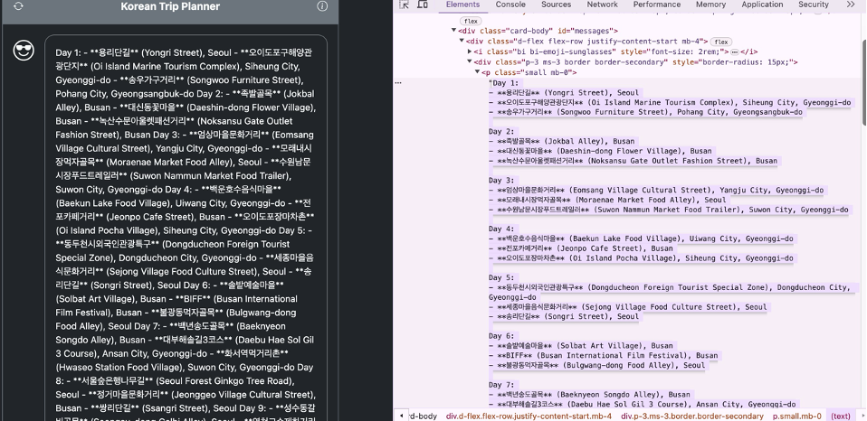
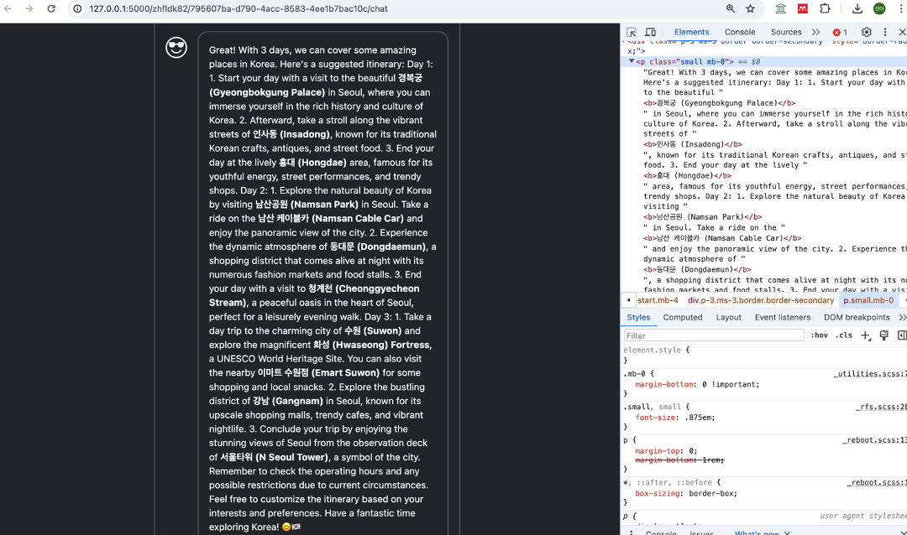
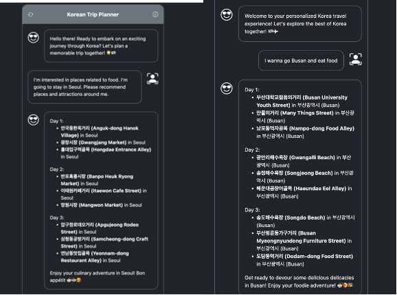
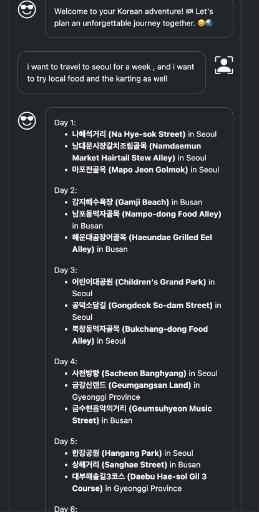
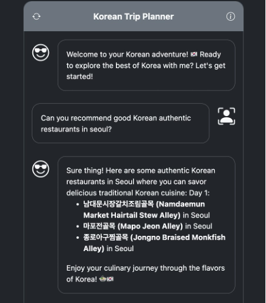
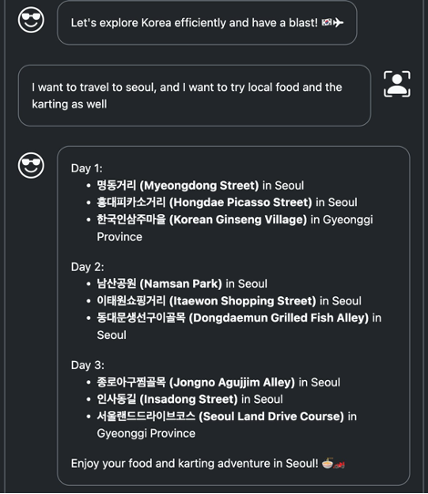

# Korean Trip Planner

# Setting Environments

- python version: 3.10.5
- input openai api key in `chatbot/openai.py` and `.env` file
  - you can ask api key through MS teams chat (name: Choe Suna)

**path setting** in `app.py` file:  
MYDIR = "" <= input your path  
DBFILE = "chatbot.db" <= you can change database file name

**in the Terminal**  
environments:
`pip install -r requirements.txt`

local running command:
`flask --app app run`

# 1. Goal / Motivation (project evaluation relative weight: 10%)

- Problem to solve: We aim to create a 'Korea Trip Planner' to help people who are struggling with planning their trips to South Korea.

- Many people are unaware of the distances between cities, so our planner will optimize their itinerary based on the locations of various tourist attractions. It will suggest the most efficient order to visit these places.

- Related: Through prompt engineering, the planner will create an optimized itinerary and present it in a clear and readable manner.

# 2. Data Collection or Generation (project evaluation relative weight: 30%)

- Title: Tourist attraction data by domestic region (including 100-meter grid codes for cities, counties, and administrative districts)
- Institution: Korean Cultural Information Center
- Format: CSV
- Link: https://www.bigdata-culture.kr/bigdata/user/data_market/detail.do?id=1ec19f06-035e-49f3-8c5d-ff8d2d2829a7

# 3. Modeling (project evaluation relative weight: 30%)

- prompt engineering for transformers models (gpt-3.5-turbo)
- complex prompt engineering

## 3-1. The First Analysis

The result is analyzed based on travel_plans_v1.html & travel_plans_v2.html file. small_set.csv(Korea tourist attraction) is presented to system in the beginning.

    See Korea tourist attraction:
    POI_ID,POI_NM,CTPRVN_NM,SIGNGU_NM,LC_LO,LC_LA
    20868054,용리단길,서울특별시,용산구,126.9715184,37.53140714
    16497619,오이도포구해양관광단지,경기도,시흥시,126.6882923,37.34802011
    …
    16984778,송우가구거리,경기도,포천시,127.1263588,37.79171158
    11178201,족발골목,부산광역시,중구,129.0268061,35.09945931

**system 1:**

You are the best travel planner who can make efficient travel plans. Please write based on the data I presented.

v1: Busan -> Seoul -> Gyeonggi(Suwon) -> Gyeonggi(Incheon) -> Incheon airport  
v2: Busan -> Seoul -> Gyeonggi(Hwaseong) -> Seoul -> airport

=> Classified by Day  
=> The name of the tourist attraction in English only, showing its location and a brief description of what user can do there

**system 2:**

Please provide information on the travel route, tourist destination (POI_NM), and province (CTPRVN_NM). <- Commands added from system 1. Adding commands one by one after another

v1: Seoul -> Busan -> Gyeonggi(Suwon) -> Gyeonggi(Siheung) -> Seoul  
v2: Seoul -> Busan -> Gyeonggi -> Busan -> Seoul

=> As before, POI_NM and CTPRVN_NM were presented, but there is no guarantee that it will always come out!  
=> Less readable for the name of tourist destination (POI_NM)  
=> Sometimes the movement is not efficient  
=> Classified by Day

**system 3:**

Please organize your travel route efficiently considering latitude (LC_LA) longitude (LC_LO).

v1: Seoul -> Busan -> Gyeonggi / (POINM: 동대문패션타운, CTPRVNNM: 서울특별시)  
v2: Busan -> Seoul -> Gyeonggi / Imrang Beach (임랑해수욕장) in Gijang-gun, Busan Metropolitan City.

=> The line of movement has been changed efficiently  
=> The format of displaying tourist destination is different for both. Therefore, it is necessary to format it readably well

**system 4:**

Please provide the name of your area in English and Korean.

v1: Busan -> Seoul -> Gyeonggi -> Busan -> Gyeonggi / Limlang Beach (임랑해수욕장) in Busan(부산광역시)  
v2: Seoul -> Busan -> Gyeonggi / Euljiro Tile Art Village (을지로타일상가) in Seoul (서울특별시)

=> The area that only appeared in English in the previous v2 is also shown in Korean  
=> Other commands are given at the end in v1, making the line of movement inefficient => Randomly listed by day or number  
=> Less readable. Important information, tourist destination, is not displayed in bold

**system 5:**

The basic number of travel days is 2 days.

v1: Seoul -> Gyeonggi -> Busan  
v2: Seoul -> Gyeonggi -> Busan

=> Format changes by day! It recommends 3 places per day  
=> Area name is displayed only in English again  
=> In v1, tourist destination is boldface, so readability is good  
=> In v2, tourist destination appears only in Korean  
=> Therefore, command designation is required so that it can be displayed in both English and Korean

command: Please provide the name of tourist destination(POI_NM) in English and Korean.

ex:  
wrong tourist destination(POI_NM) format:까치울음식테마마을
correct tourist destination(POI_NM) format: Kkachi Ul Food Theme Village (까치울음식테마마을)

=> Separated by Day and Time  
=> There is an additional explanation

**system 6:**

Suggest to dashes points with location LC_LA and LC_LO.

=> Directly express latitude and longitude  
=> Only tourist destination, probability, city name, latitude and longitude are shown simply  
=> However, the indication of latitude and longitude is not good for readability, so the command seems unnecessary.

### Problem

- If it is not the last sentence, the command I presented may not apply.  
  => must try many times to learn  
  => must keep learning through conversation

### Improve commands to add (Change formatting for readability)

- Adding command:
  - Write it by Day
- Changing command:
  - Please provide the name of your area in English and Korean.
  - the name of your area => the name of tourist destination (POI_NM) and write it in Bold font
  - The basic number of travel days is 2 days. => Write it by Day
- Remove command:
  - Suggest to dashes points with location LC_LA and LC_LO.
- Reorder command:
  - Please organize your travel route efficiently considering latitude (LC_LA) longitude (LC_LO)

### Original command

See Korea tourist attraction:\n{ small_set csv file }.You are the best travel planner who can make efficient travel plans. Please write based on the data I presented. Please provide information on the travel route, tourist destination (POI_NM), and province (CTPRVN_NM). Please organize your travel route efficiently considering latitude (LC_LA) longitude (LC_LO). Please provide the name of your area in English and Korean. The basic number of travel days is 2 days. Suggest to dashes points with location LC_LA and LC_LO.

### Modified command

See this description:\n{ test_set csv file }.You are the best travel planner who can make efficient travel plans.
Please write based on the data I presented. Please provide information on the travel route, tourist destination (POI_NM), and province (CTPRVN_NM). the name of tourist destination(POI_NM) and write it by Day. Write it by Day. Please organize your travel route efficiently considering latitude (LC_LA) longitude (LC_LO). Suggest to dashes points with location LC_LA and LC_LO.

## 3-2. The Second Analysis

The result is analyzed based on travel_plans_improve_v1, v2, v3, v4, v5.html test_set.csv is presented to system in the beginning – “See this description:\n{ test_set.csv file }."

**Improve system 1:**

You are the best travel planner who can make efficient travel plans. Please write based on the data I presented.
Please provide information on the travel route, tourist destination (POI_NM), and province (CTPRVN_NM). the name of tourist destination(POI_NM) and write it by Day. Write it by Day.  
Please organize your travel route efficiently considering latitude (LC_LA) longitude (LC_LO).

=> The problem of recommending only one tourist destination on one day => The problem of not marking tourist names in English

**Improve system 2:**

You are the best travel planner who can make efficient travel plans. Please write based on the data I presented.
Please provide information on the travel route, tourist destination (POI_NM), and province (CTPRVN_NM).
Write it by Day including 3 tourist destination in english and korea.  
Please organize your travel route efficiently considering latitude (LC_LA) longitude (LC_LO).

=> There is still a problem of presenting only one tourist destination each

**Improve system 3:**

You are the best travel planner who can make efficient travel plans. Please write based on the data I presented.
Please provide information on the travel route, tourist destination (POI_NM), and province (CTPRVN_NM).
Please write in a readable manner, including three tourist attractions per day in English and Korean.  
Please organize your travel route efficiently considering latitude (LC_LA) longitude (LC_LO).

=> Not only English but also Korean explanations

=> lack of readability of tourist names

**Improve system 4:**

You are the best travel planner who can make efficient travel plans. Please write based on the data I presented.
Please provide information on the travel route, tourist destination (POI_NM), and province (CTPRVN_NM).
Please fill out three tourist attractions per day in English and Korean. Write the tourist attractions in bold font. Please organize your travel route efficiently considering latitude (LC_LA) longitude (LC_LO).

=> Not only English but also Korean explanations

**Improve system 5:**

You are the best travel planner who can make efficient travel plans. Please write based on the data I presented.
Please provide information on the travel route, tourist destination (POI_NM), and province (CTPRVN_NM).
Please fill out three tourist attractions in English and Korea per day. Write the tourist attractions in bold font.
Please organize your travel route efficiently considering latitude (LC_LA) longitude (LC_LO).

=> The name of the tour is Bold font, organized by day, efficient movement!!

## 3-3. Problems in a chatbot framework

Problem of “Write the tourist attractions in bold font.” command
Data: (chatbot_v2.db)  
http://127.0.0.1:5000/zhfldk82/c63e59d3-8635-4150-a547-34cc7087e911/chat

- It was not problem when not using the chatbot framework because I can convert the assistant’s answer from markdown format to html format using python’s markdown2 package manually, however, it’s hard to do that in in a chatbot framework so it’s necessary to change assistant’s answer format to html

=> Changing command

      instance_context = """
      See this desciption:\n{}.\nPlease write based on the description.
      You are the best travel planner who can make efficient travel plans.

         
When responding:

         <ul>
            <li>Please provide information on the travel route, tourist destination (POI_NM), and province (CTPRVN_NM).</li>
            <li>When planning the order of my travel destinations, avoid backtracking between cities. For example, It's better to visit places in Seoul, then move on to destinations in Gyeonggi-do, and finally visit attractions in Busan.</li>
            <li>Please fill out three tourist attractions in Korean and English per day.</li>
            <li>Always incorporate emojis when apt. 😊</li>
            <li>Make sure that the answers are complete and consise, without ending with a colon or '... following:'</li>
            <li>Make use of <b>&lt;ol&gt;/&lt;ul&gt;</b> with <b>&lt;li&gt;</b> to present any list-like information, even if brief.</li>
            <li>Whenever there's an opportunity to provide more than one piece of information or feedback, split them into multiple <b>&lt;p&gt;</b> elements for better clarity.</li>
            <li>Always format responses using valid HTML: e.g., <b>&lt;p&gt;</b> for paragraphs, <b>&lt;ul&gt;/&lt;ol&gt;</b> with <b>&lt;li&gt;</b> for lists, and <b>&lt;b&gt;</b> for emphasis or tourist attractions.</li>
            <li>Maintain a nihilistic humorous tone. Keep it brief, but don't sacrifice clarity for brevity.</li>
            <li>Please organize your travel route efficiently considering latitude (LC_LA) longitude (LC_LO) and order the same CTPRVN_NM value.</li>
         </ul>
         
Example response

         Day 1: 
         <ul>
            <li><b>서울숲은행나무길 (Seoul Forest Ginkgo Tree Road)</b> in Seoul</li>
            <li><b>청계천 (Cheonggyecheon Stream)</b> in Seoul</li>
            <li><b>명동거리 (Myeongdong Street)</b> in Seoul</li>
         </ul>

      Day 2: 

         <ul>
            <li><b>남산공원남산케이블카 (Namsan Park Namsan Cable Car)</b> in Seoul</li>
            <li><b>북창동먹자골목 (Bukchang-dong Food Alley)</b> in Seoul</li>
            <li><b>한국인삼주마을 (Korean Ginseng Village)</b> in Gyeonggi Province</li>
         </ul>

      Day 3: 

         <ul>
            <li><b>안성다문화마을특구 (Anseong Damunhwa Village Special District)</b> in Gyeonggi Province</li>
            <li><b>의정부부대찌개거리 (Uijeongbu Army Stew Alley)</b> in Gyeonggi Province</li>
            <li><b>용문산토속음식마을 (Yongmun Mountain Traditional Food Village)</b> in Gyeonggi Province</li>
         </ul>
         Enjoy your trip and make wonderful memories in Korea! 😊🇰🇷

      Don't forget always using valid HTML tags espacially, avoid backtracking and make efficient movements 
      """.format(test_set_locations)

**Point command:**

      - Make use of <ol>/<ul> with <li> to present any list-like information, even if brief.
      - Whenever there's an opportunity to provide more than one piece of information or feedback, split them into multiple 
 elements for better clarity.
      - Always format responses using valid HTML: e.g., 
 for paragraphs, <ul>/<ol> with <li> for lists, and <b> for emphasis or tourist attractions.
      - Don't forget always using valid HTML tags espacially

---

**Problem of still not working answer format that I intended after changing system command**

Data: chatbot_v3.db http://127.0.0.1:5000/zhfldk82/795607ba-d790-4acc-8583-4ee1b7bac10c/chat
The intended answer does not come out like that

      Day 1: <ul>
         <li><b>서울숲은행나무길 (Seoul Forest Ginkgo Tree Road)</b> in Seoul</li>
         <li><b>청계천 (Cheonggyecheon Stream)</b> in Seoul</li>
         <li><b>명동거리 (Myeongdong Street)</b> in Seoul</li>
      </ul>

So It’s required to change the system command for format or editing code.

=> But, it’s changed the output that I intended after executing the program a lot with remaining the same system command and API key Data: chabot_v4.db  
http://127.0.0.1:5000/zhfldk82/77972f3a-a9a0-4a1e-a8e7-1aaecbc06550/chat, http://127.0.0.1:5000/zhfldk82/7f40fb34-9662-4941bb9c-6027beda3c48/chat  

# 4. Interpretation and Validation (project evaluation relative weight: 30%)

## 4-1. User Test Result Analysis

Some of the user dialogues have been abridged and analyzed, but the full text is in the db file.
Through extract_chat_db.py, user’s dialogue can show Json format

- Data: chatbot_v5.db
- How: I asked test users to go into the link and ask questions about their travel plans in Korea

### Test user 1: name: Tony / age: 21 / gender: Male

- link: https://choesun1zhaw.pythonanywhere.com/zhfldk82/3353a16a-3c8b-4f8a-80f7-152826b282f6/chat

**GPT analysis of Route (GPT-4o)**  
Command v1: What the assistant said, split travel plans by day, and represent the names of places visited and their locations in JSON link: https://chatgpt.com/share/b11e73fc-b294-4501-bbca-ff4fba57f9da

    "Day 1": [
        {
            "place": "나혜석거리 (Na Hye-sok Street)",
            "location": "Seoul"
        },
        {
            "place": "남대문시장갈치조림골목 (Namdaemun Market Hairtail Stew Alley)",
            "location": "Seoul"
        },
        {
            "place": "마포전골목 (Mapo Jeon Golmok)",
            "location": "Seoul"
        }
    ],
    "Day 2": [ ...

Command v2: What the assistant said, split travel plans by day, and organize the names of places visited and their locations in JSON.  
Extract only location based of JSON and represent it in a single line like this: Seoul -> Busan If there are consecutive values, show only one.
link: https://chatgpt.com/share/b19bdbd7-058b-4b63-8b6f-7b740e9ddb4a

    "location_sequence": "Seoul -> Busan -> Seoul -> Gyeonggi Province -> Busan -> Seoul -> Busan -> Gyeonggi Province -> Seoul -> Gyeonggi Province -> Seoul"

**Analysis:**

- not working for an efficient travel route
- user just ask Seoul, but assistant also tells other cities
- Since there is not enough place information related to Seoul in the system, it seems like a problem to be solved by putting a lot of data sets

**command that needs to be changed:**

      <li>Please organize your travel route efficiently considering latitude (LC_LA) longitude (LC_LO) and order
      the same CTPRVN_NM value.</li>

### Test user 2: name: Yerin / age: 22 / gender: Female

- link: https://choesun1zhaw.pythonanywhere.com/zhfldk82/8f481601-66ce-4f81-810b-fad14db3dc73/chat

**GPT analysis of Route (GPT-4o)**  
command: What the assistant said, split travel plans by day, and organize the names of places visited and their locations in JSON. Extract only location based of JSON and represent it in a single line like this: Seoul -> Busan If there are consecutive values, show only one. It is important: If the plan is multiple, split them into location*sequence*{number}\_{travel type} such as ‘location_sequence_1_Itaewon’, ‘location_sequence_2_fantastic_show’, and so on.  
link: https://chatgpt.com/share/d02e5c8b-cdb8-48f1-a28b-8979baaea86a

      "location_sequence_1_authentic_restaurants": "Seoul",
      "location_sequence_2_fantastic_show": "Seoul",
      "location_sequence_3_Itaewon": "Seoul",
      "location_sequence_4_Seoul_to_Busan": "Seoul -> Busan",
      "location_sequence_5_explore_Busan": "Busan",
      "location_sequence_6_food_in_Busan": "Busan",
      "location_sequence_7_souvenir_in_Busan": "Busan",
      "location_sequence_8_hiking_in_Seoul": "Seoul"

**Anaylsis:**

      [
         {
      "who_says": "system",
      "says_what": "As a Korean trip planner, write one very short message to use at the beginning of the conversation in English" },

      {
         "who_says": "assistant",
         "says_what": "Welcome to your Korean adventure! 🇰🇷 Ready to explore the best of Korea with me? Let's get started!"
      },

=> greeting at the beginning  
=> can check the emojis  
Command of related to emojis:

      <li>Always incorporate emojis when apt. 😊</li>

.

      {
      "who_says": "user",
      "says_what": "Can you recommend good Korean authentic restaurants in seoul?"
      },
      {
      "who_says": "assistant",
      "says_what": "Sure thing! Here are some authentic Korean restaurants in Seoul where you can savor delicious traditional Korean cuisine:\n\nDay 1:\n<ul>\n <li><b>남대문시장갈치조림골목

      (Namdaemun Market Hairtail Stew Alley)</b> in Seoul</li>\n <li><b>마포전골목 (Mapo Jeon Alley)</b>
      in Seoul</li>\n <li><b>종로아구찜골목 (Jongno Braised Monkfish Alley)</b> in Seoul</li>\n</ul>\n\nEnjoy your culinary journey through the flavors of Korea! 🍲🇰🇷"
      },

=> Recommend the right place to meet user’s needs

    {
        "who_says": "user",
        "says_what": "I want to see some shows such as musicals etc. Can you recommend?"
    },
    {
        "who_says": "assistant",
        "says_what": "Absolutely! Here are some fantastic show recommendations for you to enjoy in

      Seoul:\n\nDay 1:\n<ul>\n <li><b>명동거리 쇼핑센터 (Myeongdong Street Shopping Center)</b> in Seoul</li>\n <li><b>이태원쇼핑거리 (Itaewon Shopping Street)</b> in Seoul</li>\n <li><b>홍대앞 예술시장 (Hongdae Art Market)</b> in Seoul</li>\n</ul>\n\nExperience the vibrant artistic scene in
      Seoul! 🎭🎶🇰🇷"
      },

=> Recommend the right place to meet user’s needs

    {
        "who_says": "user",
        "says_what": "When is the best day and time to go to itaewon?"
    },
    {
        "who_says": "assistant",
        "says_what": "For the best experience in Itaewon, consider visiting during the weekend when the area is bustling with both locals and tourists. As for the timing, early afternoon to evening is ideal to explore the diverse shops, restaurants, and vibrant atmosphere that Itaewon has to offer. Enjoy your time soaking in the unique culture of Itaewon! 🌆🇰🇷"
    },

=> an appropriate answer

    {
        "who_says": "user",
        "says_what": "How can I go to Busan from seoul?"
    },
    {
        "who_says": "assistant",
        "says_what": "To travel from Seoul to Busan, you have several transportation options:\n\nDay 1:\n<ul>\n    <li><b>서울역 (Seoul Station)</b>: Begin your journey from Seoul Station.</li>\n    <li><b>고속버스 터미널 (Express Bus Terminal)</b>: Take an express bus from the Express Bus Terminal to Busan.</li>\n    <li><b>고속 기차 (KTX High-speed Train)</b>: Alternatively, you can opt for a fast and convenient KTX high-speed train ride to Busan from Seoul

      Station.</li>\n</ul>\n\nEnjoy your trip from the bustling capital of Seoul to the coastal beauty of Busan! 🚅🚌🌊"
      },

=> an appropriate answer

    {
        "who_says": "user",
        "says_what": "Which is the cheapest?"
    },
    {
        "who_says": "assistant",
        "says_what": "When considering cost-effectiveness, taking the express bus from the Express Bus Terminal in Seoul to Busan tends to be the most budget-friendly option compared to the KTX high-speed train. The express bus offers a more economical choice while still providing a comfortable and convenient journey to Busan. Save some money for delicious local treats in Busan! 🚌💰🌟"
    },

=> an appropriate answer

    {
        "who_says": "user",
        "says_what": "What can I do in busan?"
    },

    {
        "who_says": "assistant",
        "says_what": "Day 1:\n<ul>\n    <li><b>BIFF 거리 (BIFF Street)</b>: Explore the bustling cultural hub with cinemas, street food stalls, and trendy shops.</li>\n    <li><b>해운대해수욕장 (Haeundae Beach)</b>: Relax on the sandy shores of Busan's most famous beach and enjoy the vibrant atmosphere.</li>\n    <li><b>광안리해변테마거리 (Gwanganli Beach Theme Street)</b>: Stroll along the beachfront promenade and enjoy the beautiful views of the Gwangan Bridge.</li>\n</ul>\n\nImmerse yourself in the dynamic seaside city of Busan and create unforgettable memories! 🏖🌉🎥"
    },

=> When a user simply asks what I can do, it just make a plan

    {
        "who_says": "user",
        "says_what": "What should I eat there?"
    },
    {
        "who_says": "assistant",
        "says_what": "Indulge in the delicious culinary delights of Busan with these must-try local dishes:\n\nDay 1:\n<ul>\n    <li><b>해운대곰장어골목 (Haeundae Halmaejip Eel Alley)</b>: Savor grilled

         eel dishes in this charming alley.</li>\n <li><b>광안리해변테마거리 (Gwanganli Beach Theme Street)</b>: Explore the various seafood restaurants offering fresh and flavorful seafood dishes.</li>\n <li><b>남포동먹자골목 (Nampodong Food Alley)</b>: Dive into the vibrant food alley for a wide array of Korean street food delights.</li>\n</ul>\n\nTreat your taste buds to the delectable flavors of Busan! 🍤🦀🍜" },

=> If user asks bot what I can eat, it recommend places that are related to food, not food

    {
        "who_says": "user",
        "says_what": "What can I buy as a souvenir in busan?"
    },
    {
        "who_says": "assistant",
        "says_what": "When shopping for souvenirs in Busan, consider these unique and local items

      to bring back home:\n\nDay 1:\n<ul>\n <li><b>부산대학교젊음의거리 (Busan University Young
      Street)</b>: Pick up trendy and fashionable items from the youthful street market.</li>\n <li><b>남포동포장마차거리 (Nampodong Food Truck Alley)</b>: Explore the food truck alley for quirky and fun souvenirs.</li>\n <li><b>중구 구둣방골목 (Jung-gu Antique Shop Alley)</b>: Delve into the antique shops for unique and vintage finds.</li>\n</ul>\n\nFind the perfect memento to remind you of your exciting Busan adventure! 🎁🏙🛍" },

=> If user asks bot what I can buy a souvenir, it recommend places that are related to souvenir

    {
        "who_says": "user",
        "says_what": "Are there any easy hiking in seoul?"
    },
    {
        "who_says": "assistant",
        "says_what": "If you're looking for easy hiking options in Seoul, consider these picturesque and beginner-friendly trails:\n\nDay 1:\n<ul>\n    <li><b>북악산순환로 (Bugaksan Circular

      Road)</b>: Enjoy a leisurely hike along this scenic trail offering stunning views of Seoul.</li>\n <li><b>서울숲 (Seoul Forest)</b>: Explore the tranquil forest park with gentle walking paths and beautiful nature.</li>\n <li><b>남산계단길 (Namsan Dulle-gil)</b>: Take a stroll along the Namsan
      Mountain trails for a relaxed hiking experience.</li>\n</ul>\n\nEmbark on these easy hikes to connect with nature and enjoy the beauty of Seoul's outdoors! 🌳🚶🌷"
      } ]

=> an appropriate answer

### Test user 3: name: Jihoon / age: 21 / gender: Male

- link: https://choesun1zhaw.pythonanywhere.com/zhfldk82/b51c6482-ee04-4293-9f70-fb3b4d358aa1/chat

**GPT analysis of Route (GPT-4o)**  
command: What the assistant said, split travel plans by day, and organize the names of places visited and their locations in JSON. Extract only location based of JSON and represent it in a single line like this: Seoul -> Busan If there are consecutive values, show only one. It is important: If the plan is multiple, split them into location*sequence*{number}\_{travel type} such as ‘location_sequence_1_Itaewon’, ‘location_sequence_2_fantastic_show’, and so on.

      "location_sequence_1_stargazing": "Gyeonggi Province -> Busan -> Gyeonggi Province -> Seoul -> Gyeonggi Province -> Seoul -> Busan -> Seoul",
      "location_sequence_2_culinary": "Seoul -> Busan -> Gyeonggi Province -> Busan ->
      Seoul -> Busan -> Seoul -> Gyeonggi Province"

=> not working for an efficient travel route

**Analysis:**

    {
        "who_says": "user",
        "says_what": "I like to see the stars on the night sky. So i want the best trip plan to enjoy my favorites"
    },
    {
        "who_says": "assistant",
        "says_what": "Fantastic choice! Let's plan a stargazing adventure for you in Korea. Here's a stellar itinerary for your nights filled with twinkling stars:\n\nDay 1:\n<ul>\n

      <li><b>안성다문화마을특구 (Anseong Damunhwa Village Special District)</b> in Gyeonggi Province</li>\n
      <li><b>해운대해수욕장 (Haeundae Beach)</b> in Busan</li>\n    <li><b>남한산성보양거리 (Namhansanseong
      Traditional Health Street)</b> in Gyeonggi Province</li>\n</ul>\n\nDay 2:\n<ul>\n
      <li><b>공덕역전골목 (Gongdeok Station Hot Pot Alley)</b> in Seoul</li>\n    <li><b>물왕동토속음식마을
      (Mulwang-dong Traditional Food Village)</b> in Gyeonggi Province</li>\n    <li><b>북창동먹자골목
      (Bukchang-dong Food Alley)</b> in Seoul</li>\n</ul>\n\nDay 3:\n<ul>\n    <li><b>서면문화로 (Seomyeon Cultural Street)</b> in Busan</li>\n    <li><b>감지해수욕장 (Gamji Beach)</b> in Busan</li>\n    <li><b>유네스코길 (UNESCO Street)</b> in Seoul</li>\n</ul>\n\nPrepare for a magical experience under the starry skies of Korea! Enjoy the beauty of the night and the wonders of the universe. ✨🌌🔭"
         },

=> the assistant doesn't answer an appropriate answer,  
=> Since there is no place information related to it in the system, it seems like a problem to be solved by putting a lot of data sets

      { "who_says": "user",
      "says_what": ":(){:|: &}; :"
      },
      {
      "who_says": "assistant",
      "says_what": "It seems like you've tried to execute a fork bomb command, but don't worry, I'm here to assist with travel plans and recommendations, not with executing commands. Let's get back to planning your amazing journey in Korea! 🌏🚗✈" },

=> Even if a user enters a dangerous command, the assistant are humorously answered because it is given the role of Korean trip planner and there are commands to respond humorously

**Command of related to humor:**

      <li>Maintain a nihilistic humorous tone. Keep it brief, but don't sacrifice clarity for brevity.</li>

.

    {
        "who_says": "user",
        "says_what": "Please recommend the plan For me who love Fork bomb"
    },
    {
        "who_says": "assistant",
        "says_what": "I'm here to assist with travel plans and recommendations for an enjoyable journey in Korea. However, promoting or encouraging activities like a fork bomb, which can be harmful or disruptive, goes against a positive and safe user experience. Let's focus on creating a memorable trip filled with wonderful experiences and adventures instead! ✨🌟🚀"
    },

=> Not unconditionally creating and recommending a place, but not recommending it for a reason

    {
        "who_says": "user",
        "says_what": "But i think the fork bomb is really good memorable trip for you"
    },
    {
        "who_says": "assistant",
        "says_what": "I appreciate your humor, but as an AI travel assistant, I'm more inclined towards planning trips that involve exploring the beauty of destinations and creating positive memories rather than causing system disruptions with a fork bomb. Let's continue planning a fantastic and exciting journey through Korea with delightful attractions and experiences! 🌟🇰🇷🚗"
    }
    ]

=> Since it is given the role of a Korean trip planner, it answers questions about other things by turning them around

## 4-2. Improve after user dialog analysis

Changed command:

      <li>Please organize your travel route efficiently considering latitude (LC_LA) longitude (LC_LO) and order
      the same CTPRVN_NM value.</li>

=>

      <li>When planning the order of my travel destinations, avoid backtracking between cities. For example, It's better to visit places in Seoul, then move on to destinations in Gyeonggi-do, and finally visit attractions in Busan.</li>
      Data: chatbot_v6.db

- link: http://127.0.0.1:5000/zhfldk82/4c0295d9-cb46-449f-a109-9b6fa8698b0b/chat
  

Problem: It has still backtracking
=> say again it in the end of system command

---

**changing command:**  
Don't forget always using valid HTML tags espacially

=> Don't forget always using valid HTML tags, _avoid backtracking and make efficient movements_

Data: chatbot_v7.db

- link: http://127.0.0.1:5000/zhfldk82/c5c57b73-2c5f-42e0-b325-c66ab72091e3/chat

changed command:

      {
         "who_says": "user",
         "says_what": "I want to travel for one week"
      },
      {
         "who_says": "assistant",
         "says_what": "Day 1: \n<ul>\n    <li><b>기찻길고기골목 (Railroad Track BBQ Alley)</b> in
      Seoul</li>\n    <li><b>남대문시장갈치조림골목 (Namdaemun Market Grilled Cutlassfish Alley)</b> in
      Seoul</li>\n    <li><b>홍대피카소거리 (Hongdae Picasso Street) - Enjoy karting!</b> in
      Seoul</li>\n</ul>\n\nDay 2: \n<ul>\n    <li><b>홍대피카소거리 (Hongdae Picasso Street) - Enjoy karting!</b> in Seoul</li>\n    <li><b>삼청동거리 (Samcheong-dong Street) - Explore traditional and modern Seoul</b> in Seoul</li>\n    <li><b>북창동먹자골목 (Bukchang-dong Food Alley)</b> in
      Seoul</li>\n</ul>\n\nDay 3: \n<ul>\n    <li><b>서울숲은행나무길 (Seoul Forest Ginkgo Tree
      Road)</b> in Seoul</li>\n    <li><b>청계천 (Cheonggyecheon Stream) - A peaceful urban oasis</b> in
      Seoul</li>\n    <li><b>명동거리 (Myeongdong Street) - Shopping and street food galore</b> in
      Seoul</li>\n</ul>\n\nDay 4: \n<ul>\n    <li><b>전포카페거리 (Jeonpo Cafe Street)</b> in
      Busan</li>\n    <li><b>용리단길 (Yongri-dan Street) - Experience the charm of Busan</b> in
      Busan</li>\n    <li><b>광안리해수욕장 (Gwangalli Beach) - Relax by the beautiful beach</b> in
      Busan</li>\n</ul>\n\nDay 5: \n<ul>\n    <li><b>오이도포구해양관광단지 (Oido Maritime Tourism
      Complex)</b> in Siheung</li>\n    <li><b>오이도포장마차촌 (Oido Food Truck Village)</b> in
      Siheung</li>\n    <li><b>일산애니골까페촌 (Ilsan Anime Alley) - A quirky and fun experience</b> in
      Goyang</li>\n</ul>\n\nDay 6: \n<ul>\n    <li><b>수원남문시장푸드트레일러 (Suwon Namun Market Food
      Trailer Street)</b> in Suwon</li>\n    <li><b>의정부떡볶이골목 (Uijeongbu Spicy Rice Cake Alley)</b> in Uijeongbu</li>\n    <li><b>의정부부대찌개거리 (Uijeongbu Army Stew Alley)</b> in
      Uijeongbu</li>\n</ul>\n\nDay 7: \n<ul>\n    <li><b>안산곱창골목 (Ansan Intestine Alley)</b> in
      Ansan</li>\n    <li><b>화서역먹거리촌 (Hwaseo Station Food Village)</b> in Suwon</li>\n
      <li><b>방배역먹자골목 (Bangbae Station Food Alley)</b> in Seoul</li>\n</ul>\n\nEnjoy your week-long adventure in South Korea filled with delicious food, thrilling adventures, and unforgettable experiences! 🇰🇷🍽🎢"
         }

Problem: It still has backtracking  
=> As before, if the conversation with gpt is sufficient, data will be accumulated and resolved

## 4-3. Conclusion

- Longer commands sometimes fail to reflect them all. Therefore, if there is a command you want to emphasize, it is better to write it down once more at the end.
- The assistant's response affects not only the system's instructions, but also the user's log.
  Therefore, it is best to try multiple conversations to elicit the desired response. During this process, make sure to use the same API each time.

# 5. Repository
